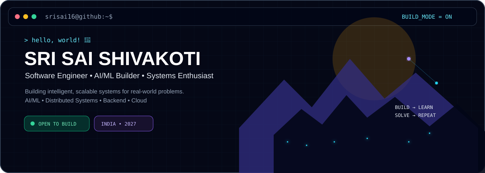
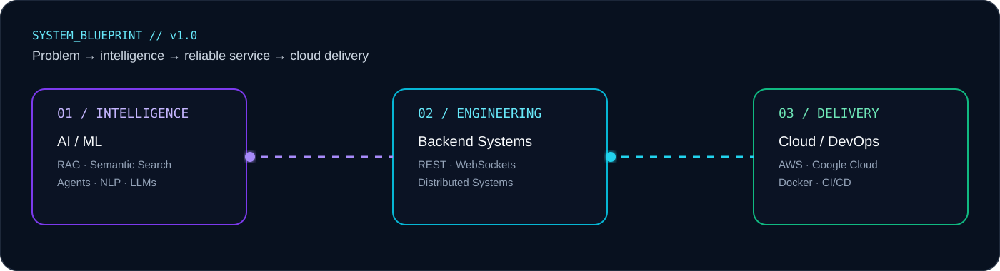
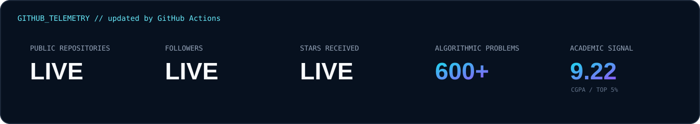

<!-- SRI SAI SHIVAKOTI | GitHub Profile README -->
<p align="center"></p>

<p align="center">
<a href="https://github.com/Srisai16"></a>
<a href="https://www.linkedin.com/in/srisai-shivakoti16"></a>
<a href="mailto:srisai.shivakoti@gmail.com"></a>
<a href="https://leetcode.com/u/srisai_shivakoti/"></a>
</p>

<table><tr><td width="58%" valign="top">

### `srisai@dev:~$ whoami`
```text
NAME       → Sri Sai Shivakoti
ROLE       → Software Engineer / AI-ML Builder
EDUCATION  → B.Tech CSE • ACE Engineering College
CGPA       → 9.22 / 10 • Top 5%
FOCUS      → AI/ML • Backend • Distributed Systems
SOLVING    → 600+ algorithmic problems
MODE       → BUILD → LEARN → SOLVE → REPEAT
```
> I build intelligent, scalable systems that turn real-world problems into usable software.

**Currently exploring:** AI agents · RAG · semantic search · distributed AI · system design · cloud-native engineering
</td><td width="42%" valign="top">

### `⚡ quick snapshot`
| Signal | Value |
|---|---:|
| 🎯 DSA | **600+** |
| 🎓 CGPA | **9.22/10** |
| 🏆 Class Rank | **Top 5%** |
| 💻 Main Language | **Java** |
| 🧠 Core | **AI + Systems** |
| ☁️ Cloud | **AWS + Google Cloud** |
| 🥇 CodeChef | **Diamond** |
</td></tr></table>

## 🛠️ Currently Building
<table><tr>
<td width="33%" valign="top"><h3>🧠 AuraMatch</h3><b>AI-powered candidate sourcing & matching</b><p>Semantic candidate ranking, dynamic JD parsing, weighted feature scoring, anomaly detection, ATS analysis and AI-assisted interview coaching.</p><code>Python</code> <code>ML</code> <code>NLP</code> <code>Streamlit</code><br><br><a href="https://github.com/Srisai16/IndiaRuns_Hack2Skill_AuraMatch">→ View Project</a></td>
<td width="33%" valign="top"><h3>🌐 BEAMIT</h3><b>Peer-to-peer file sharing</b><p>WebRTC + WebSockets based distributed file sharing with peer discovery, signaling, chunked transfers and failure recovery.</p><code>WebRTC</code> <code>Node.js</code> <code>React</code> <code>WebSockets</code><br><br><a href="https://github.com/Srisai16/Peer-to-Peer_File_Sharing_System">→ View Project</a></td>
<td width="33%" valign="top"><h3>💰 MY FINANCE</h3><b>Personal finance intelligence</b><p>Income/expense tracking, budgets, REST APIs, automated categorization and monthly financial insights.</p><code>Next.js</code> <code>Supabase</code> <code>AWS</code><br><br><a href="https://github.com/Srisai16/MY_FINANCE">→ View Project</a></td>
</tr></table>

## 🧬 Engineering Stack
<p align="center"></p>
<table><tr><td><b>⚙️ Languages</b><br>Java · C++ · C · Python · JavaScript · TypeScript</td><td><b>🧩 Backend</b><br>REST APIs · FastAPI · Node.js · WebSockets · JWT</td><td><b>🧠 AI / ML</b><br>ML · NLP · RAG · LLMs · Semantic Search · Vector Search · AI Agents</td><td><b>☁️ Cloud / DevOps</b><br>AWS · Google Cloud · Docker · GitHub Actions · Jenkins · CI/CD</td></tr></table>

## 🏗️ How I Think About Systems
<p align="center"></p>

## 📊 GitHub Telemetry
<p align="center"></p>
<p align="center"></p>

## 🚀 Featured Systems
| Project | What it demonstrates | Stack |
|---|---|---|
| [**AuraMatch**](https://github.com/Srisai16/IndiaRuns_Hack2Skill_AuraMatch) | Semantic matching, feature fusion, anomaly detection, ATS intelligence | Python · ML · NLP |
| [**BEAMIT**](https://github.com/Srisai16/Peer-to-Peer_File_Sharing_System) | P2P architecture, signaling, WebRTC, chunked transfer, recovery | Node.js · React · WebRTC |
| [**MY FINANCE**](https://github.com/Srisai16/MY_FINANCE) | REST APIs, financial analytics, categorization, cloud backend | Next.js · Supabase · AWS |

## 🧪 Research Radar
```text
                 ┌─────────────────────┐
                 │    AI APPLICATIONS  │
                 └──────────┬──────────┘
                            │
          ┌─────────────────┼─────────────────┐
          ▼                 ▼                 ▼
      RAG / LLMs        AI AGENTS        NLP / SEARCH
          │                 │                 │
          └─────────────────┼─────────────────┘
                            ▼
               ┌────────────────────────┐
               │   INTELLIGENT SYSTEMS  │
               └────────────┬───────────┘
                            │
          ┌─────────────────┼─────────────────┐
          ▼                 ▼                 ▼
     DISTRIBUTED         BACKEND          CLOUD / MLOPS
       SYSTEMS           SYSTEMS            SYSTEMS
```

- Retrieval-Augmented Generation and semantic search
- Agentic workflows and tool-using AI systems
- Distributed systems and real-time communication
- Cloud-native backend architecture
- Vector search and production ML pipelines
- System design, reliability and performance engineering

## 🏆 Beyond the Code
<p align="center">


</p>

## 🤝 Let's Build Something Meaningful
<p align="center">
<a href="mailto:srisai.shivakoti@gmail.com"></a>
<a href="https://www.linkedin.com/in/srisai-shivakoti16"></a>
<a href="https://github.com/Srisai16"></a>
</p>
<p align="center"><sub>BUILD • LEARN • SOLVE • REPEAT</sub></p>
<p align="center"></p>
